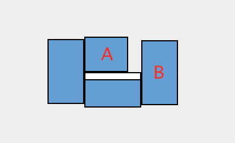

# MousePortal
Bridge Mac OS display gaps

My monitor set up has a large gap between displays A and B. This simple app allows the cursor to move fluidly accross screens.

Note: The code is very personalized for my set up. You would have to modify the code to make it work for your set-up.
